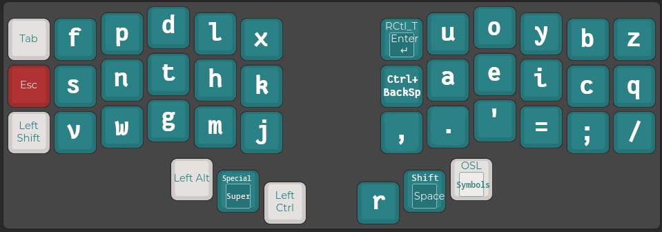
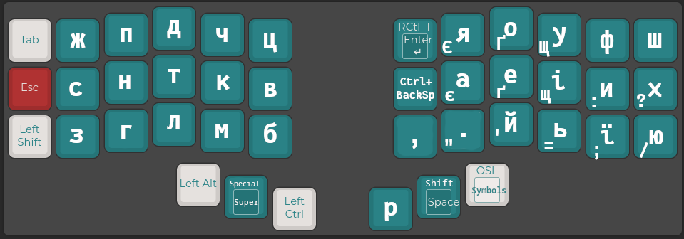
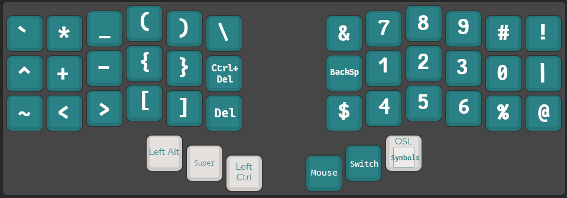
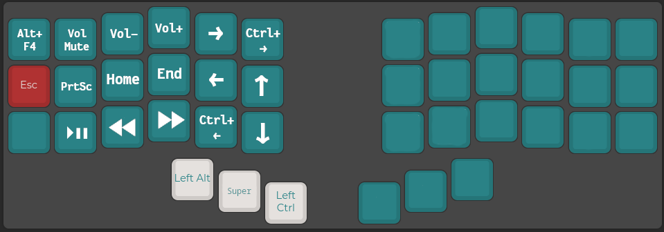
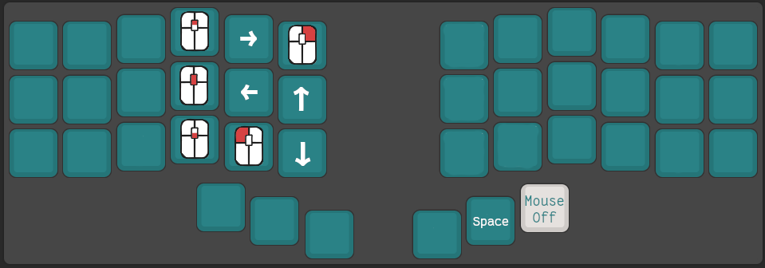
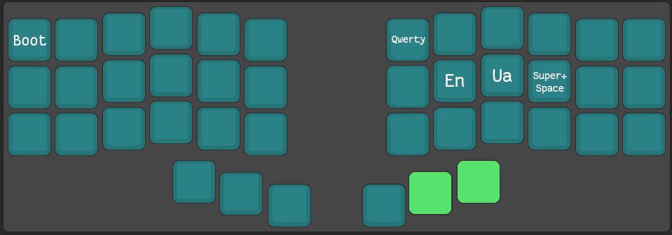

# Facet layout

A QMK keyboard layout for beekeeb/piantor_pro:
- The English layout based on Hands Down Promethium
- The Ukrainian layout generated based on a custom corpus, with home row and vowels placed to be similar to Hands Down Promethium English layout

Special treatment for symbols:
- Special layer uses hjhl for the left-down-up-right movement
- Numbers located similarly to a numpad, but with most used ones on home row
- Ctrl+BackSpace to delete the whole word by defauld
- A Mouse layout - use keyboard to send mouse actions

Better language switching:
- If Ctrl+Alt+1 and +2 are mapped to EN and UA layouts in the OS:
  - Switching layouts will also change language
  - Using symbol layout will produce the same symbols both in UA and EN layouts

*Note*: as a bare Super (or Meta/Cmd/Win) key is used rarely, the key for it by default changes layout, when held. To press Super symbol once, double tap its key. To use Super+Key combination, hold the Special and Left Ctrl keys simultaneously.

# English layout

# Ukrainian layout

# Symbols layout

# Special layout

# Mouse layout

Do mouse actions using your keyboard

# Switch layout

Switch layouts between Ukrainian, English and regular Qwerty

